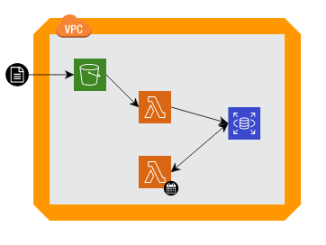

# MEDIA.MONKS CHALLENGE

### Pedido

A tu equipo llega el siguiente pedido de parte de un cliente interno: “Necesitamos una tabla con toda la información del usuario pero no nos interesa saber el detalle de los hits (interacciones) que tuvo sino solo la cantidad. Además, necesitamos otra tabla que tenga la cantidad de usuarios y hits por día”. 

### Consigna

La consigna, entonces, es la siguiente: deberás diseñar e implementar una arquitectura en Amazon Web Services (AWS) para que cada vez que se suba un JSON, se dispare automáticamente un proceso por el cual se aplane la tabla y se almacene con la información del usuario, de la sesión y la cantidad de hits (interacciones). 

Además, deberás armar un proceso que se dispare al cierre de cada día y sume la cantidad de hits y usuarios por día y los guarde en otra tabla.

### Entregable

Deberás implementar la solución en un proyecto propio (podés usar los créditos gratuitos que provee AWS). El entregable será un documento que contenga:

    - Diagrama de la arquitectura utilizada
    - Documentación paso por paso
    - El código utilizado para desarrollar las soluciones
    - Alguna captura de pantalla en caso de que lo creas relevante

Una vez listo, deberás completar el [siguiente form](https://forms.gle/99rq9wGMkgp1RxxcA) adjuntando el documento. El plazo máximo para resolverlo es de 10 días corridos.

*La consigna es relativamente general y con varios huecos a propósito. En la segunda entrevista se evaluará no solo la solución y la presentación sino el proceso de decisión y las alternativas consideradas.*

___

## ARQUITECTURA

Una funcion lambda se dispara cada vez que un nuevo archivo *.json* se carga al bucket S3, esta funcion utilizando las librerias Pandas y psycoPG2 carga la informacion en la tabla **hits** de la BD Postgres (RDS)

Otra funcion lambda tiene su schedule cron diariamente para hacer los calculos de agregacion de users y hits del dia en otra tabla de la misma BD en RDS

Las credenciales para la BD RDS se manejan por secrets manager y el logging en streams de CloudWatch

Toda esa arquitectura es desplegada por Cloud Formation programaticamente haciendo uso de la AWS CDK

Utilizamos los siguientes comandos **synth** para visualizar el ARM template y **bootstrap** seguido de **deploy** para efectivamente provisionar los recursos descriptos previamente

    $ cdk synth
    $ cdk bootstrap
    $ cdk deploy

Por ultimo para apagar los recursos luego del test utilizaremos **destroy**

    $ cdk destroy

## TEST

La notebook *probando.ipynb* tiene los resultados de las queries hechas a la RDS BD para corroborar que las Lambda functions logren el resultado esperado

Las credenciales para conectarse a la BD se generan automaticamente por Cloud Formation con lo cual hay que buscarlas en el Secrets Manager en la consola de AWS y en este caso para no exponerlas cargarlas en un archivo .env del cual las toma la notebook